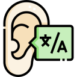

### Notas de la clase I y comentarios
¿Qué es Auditoría de sistemas de la información?

Etimológicamente del latín *auditorius* y de esta proviene auditor, que tiene la virtud de **oír y revisar cuentas**, pero debe estar encaminado a un **objetivo**.

   

## Es también...
> Según Madariaga(2004):
>> es un examen sistemático de los estados financieros, registros y operaciones con la finalidad de determinar si están de acuerdo con los principios de la contabilidad generalmente aceptados. El objetivo es averiguar la exactitud, integridad y autenticidad de los documentos financieros.

**Madariaga, J(2004). Manual practico de auditoria. Obtenida el 11 de mayo de 2016, de** [Google Books](https://books.google.com.py/books?isbn=8423419983)

### Según Mora(2008):
>**Auditoría de sistemas**. Rama especializada de la auditoría que consiste en la **evaluación** de normas, controles, técnicas y **procedimientos** establecidos en una empresa para lograr **confiabilidad, oportunidad, seguridad y confidencialidad** de la información que se procesa a través de los sistemas de información.

**Mora, A(2008). Diccionario de Contabilidad, Auditoría y Control de Gestión. Obtenida el 11 de mayo de 2016, de** [Google Books](https://books.google.com.py/books?isbn=849687723X)

### Otros autores. Auditoría 

> Según Muñoz(2002)
>> Es la revisión independiente de alguna o algunas actividades, funciones específicas, resultados u operaciones de una entidad administrativa, realizada por un personal de la auditoría, con el propósito de evaluar su correcta realización y, con base en ese análisis, poder emitir una opinión autorizada sobre la razonabilidad de sus resultados y el cumplimiento de sus operaciones.

**Muñoz, C(2002). Auditoría en sistemas computacionales. Obtenida el 25 de abril de 2021, de** [Google Books](https://books.google.es/books?id=3hVDQuxTvxwC&lpg=PR11&ots=3gLqmnxTog&dq=auditor%C3%ADa%20de%20sistemas%20de%20la%20informaci%C3%B3n&lr&hl=es&pg=PA11#v=onepage&q=auditor%C3%ADa%20de%20sistemas%20de%20la%20informaci%C3%B3n&f=false)

### Otros autores. Auditoría de Sistemas de información 

> Es la revisión técnica, especializada y exhaustiva que se realiza a los sistemas computacionales, software e información utilizados en una empresa, sean individuales, compartidos y/o de redes, así como a sus instalaciones, telecomunicaciones, mobiliario, equipos periféricos y demás componentes.

**Herrera, D(2011). Auditoría de Sistemas de Información(Tesis). Obtenida el 25 de abril de 2021, de** [Academia.edu](https://www.academia.edu/7336888/Auditor%C3%ADa_de_Sistemas_de_Informaci%C3%B3n)

> Según Tamayo(2007)
>> Se puede concluir que la auditoría de sistemas se encarga de la evaluación de todos aquellos aspectos relacionados con los recursos con los recursos informáticos de la organización como software, hardware, talento humano, funciones y procedimientos, enfocados todos ellos desde el punto de vista administrativo, técnico y de seguridad; y propende por prevenir a la empresa de aquellos riesgos originados por omisiones, errores, violaciones, actos mal intencionados, desastres naturales, etc., asesorando y proporcionando recomendaciones y sugerencias a nivel directivo para lograr un adecuado control interno de la empresa.

**Tamayo, A(2007), Auditoría de sistemas una visión práctica. Obtenida el 25 de abril de 2021, de** [Repositorio UNAL](https://repositorio.unal.edu.co/handle/unal/60273)

>La auditoría en informática es la revisión y la evaluación de los controles, sistemas, procedimientos de informática; de equipos de cómputo, su utilización, eficiencia y seguridad, de la organización que participan en el procesamiento de la información, a fin de que por medio del señalamiento de cursos alternativos se logre una utilización más eficiente y segura de la información que servirá para una adecuada toma de decisiones.

**Alvarez, L(2005), Seguridad en informática(Auditoría de sistemas)(Tesis). Obtenida el 25 de abril de 2021, de** [Ibero](http://192.203.177.185/bitstream/handle/ibero/1010/014663_s.pdf?sequence=1&isAllowed=y)