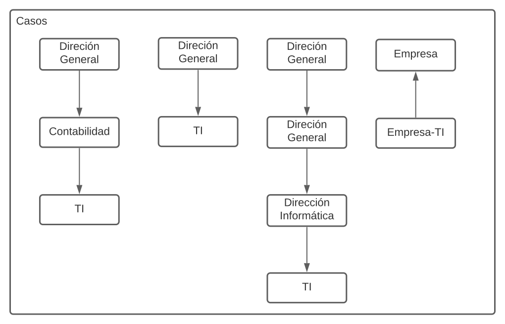
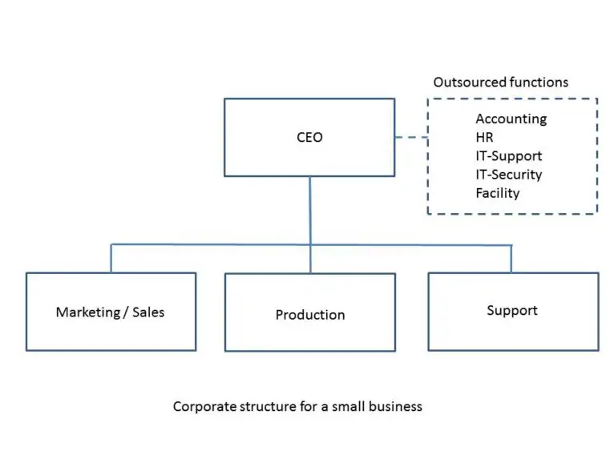
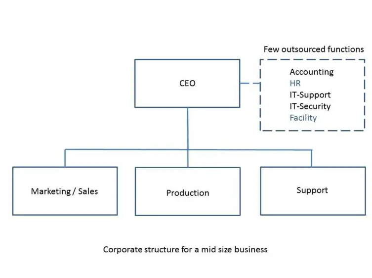
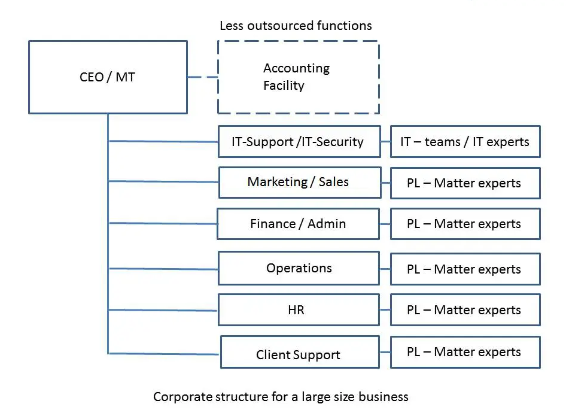

#### Índice

- [Estructura TI ideal](#estructura-ti-ideal)

- [Introducción](#introducción)

- [Planteamiento](#planteamiento)

- [Conclusión](#conclusión)

- [Introducción](#introducción)

- [Planteamiento](#planteamiento)
  
  ### Estructura TI ideal

### Introducción

> Según Henry Fayol, citado por Hall (1981), define a la organización como: 
> 
> > Organizar un negocio es dotarlo con todo lo necesario para su funcionamiento: materias primas, herramientas, capital y personal.

Quiero empezar con estas palabras ubicándonos en el contexto de crecimiento humano como especie con habilidades para la sociedad, es decir, capaz de construir cosas ayudado de conocimientos científicos y tecnológicos. No somos animales completamente gregarios como las abejas u hormigas ni solitarios como los tigres, necesitamos los unos de los otros en un lazo de interdependencia para realizarnos; es aquí donde la organización toma fuerza, desde la construcción de imperios, obras arquitectónicas hasta empresas multinacionales. Como el ser humano avanza en conocimiento y poder, sus herramientas deben acompañarlas en ese proceso evolutivo, una de ellas es del departamento de tecnología informática, con sus siglas TI. Específicamente en toda organización es necesaria, porque pasamos el conocimiento de tabillas de barro, papiros hasta la invención de la imprenta, la revolución industrial ha traído grandes avances, con ella las computadoras, la digitalización de documentos, la información. Este es un bien de capital preponderante para todo aquel que necesite gestionar el destino del emprendimiento. Ha dejado de ser un anexo para comportarse como el núcleo que alimenta el análisis para la toma de decisiones, generación de predicciones basadas en estadística, creación de modelos que explican la realidad económica. Todos estos beneficios descansan en el departamente TI, esta necesita una estructura apropiada para funcionar con eficiencia y eficacia, mejorándose continuamente a medida que avanza la ciencia.

[Ir al índice](#índice)

### Planteamiento

> En 2003, para la obtención del grado de *Maestra en Ciencias Computacionales*, Lorena Moreno en su ensayo *"La Auditoría informática"* define:
> 
> > Una vez elaborada la planeación de la auditoría, la cuál servirá como plan maestro de los tiempos, costros y prioridades, y como medio de control de la auditoría, se debe empezar la recolección de la información.
> > Se procederá a efectuar la revisión sistematizada del área a través de la observación y entrevistas de fondo en cuanto a:
> > 
> > 1. Estructura Orgánica:
> >    
> >    - Jerarquías(Definición de autoridad lineal, funcional y de asesoría)
> >    
> >    - Estructura orgánica
> >    
> >    - Funciones
> >    
> >    - Objetivos

La autora se refiere a una lista más extensa denominada en su totalidad como *Recopilación de la información organizacional*, luego vuelve a mencionar la estructura orgánica en el título *Evaluación de la estructura orgánica*:

> > Para lograr el objetivo de la evaluación de la estructura orgánica se deberá solicitar el manual de organización de la dirección, el cual deberá comprender como mínimo:
> > 
> > - Organigrama con jerarquías
> > 
> > - Funciones
> > 
> > - Objetivos y políticas
> > 
> > - Análisis, descripción y evaluación de puestos
> > 
> > - Manual de procedimientos
> > 
> > - Manual de normas
> > 
> > - Instructivos de trabajo o guías de actividad
> > 
> > También se deben solicitar:
> > 
> > - Objetivos de la dirección
> > 
> > - Políticas y normas de la dirección

Se hace interesante el descubrimiento del departamento TI según la información que recolectemos, se mencionan cuatro casos: cuando el departamento es dependiente de finanzas/contabilidad/tesorería; cuando es dependiente de la gerencia; cuando es dependiente de un departamento o gerencias mayores; cuando el departamento es una empresa.

Con dicha información podremos generar los siguientes diagramas:

 Según Wim Hoogenraad, en el departamento TI existen tres funciones principales:

- **Infraestructura** se refiere a los componentes de hardware, la red, los circuitos y todo los demás equipos necesarios para que funcione un sistema informático.

- **Funcionalidad** es quizás la tarea más visible realizada por el departamento TI. Por tanto, la funcionalidad es lo que más les asocia. Se refiere a la creación y mantenimiento de aplicaciones operativas; eso desarrollar, asegurar y almacenar datos de la organización; y ayudar en el uso de software y gestión de datos.

- **Gobernanza** se refiere a la implementación de los parámetros operativos para unidades de trabajo y el uso de sistemas de TI, *architectuur*(el arquitecto no puede fallar) y la creación  de redes de personas. Ellos establecen las reglas sobre cómo nosotros y nuestro equipo podemos utilizar la tecnología de la empresa. esto es parte del convencional *seguridad informática* y el seguro de datos del que también es responsable el departamento TI.

Y dependiendo de la gobernanza, podemos recopilar los siguientes diagramas:

- Empresas pequeñas

- Empresas medianas 

- Empresas grandes 

En estos ejemplos vemos un patrón común no menos importante que resaltar **IT-Security o Seguridad TI**, este departamento esta bien diferenciado del resto, representado como función, pero de valor fundamental para la estructura, es anterior a los departamentos subordinados al CEO, esto no quiere decir que los últimos sean de escasa relevancia, sino que todas pasa por el filtro funcional de la seguridad desarollada e implementada en TI. Ya mencionamos que el capital más valioso de la compañía es su información. No detallaremos qué incluyen o debería incluir el departamento ya que esto es dependiente de la recopilación de datos en el contexto de la empresa, su modelo de negocio y estructura orgánica, pero se demuestra a grandes rasgos que ésta debe aparecer separada de otros departamentos, con interdependencia de ellos para lograr el control deseado hacia los objetivos propuestos.

### Conclusión

Finalizamos los conceptos claves para el análisis de qué necesitamos para elaborar una estrutura orgánica, documentos a recopilar e importancia de las mismas como una fuente para generar modelos útiles sin dejar de lado la seguridad como eje central de todo departamento TI, hicimos hincapié en su interdependencia hacia otros departamentos de la empresa sin recortar los niveles o prioridades, luego ejemplificamos modelos de otros autores con el objetivo de enriquecer la perspectiva y contexto que se necesita al investigar una estructura ideal.

### Bibliografía

Moreno, L. (2003). *LA AUDITORIA EN LA INFORMÁTICA* (Ensayo). Universidad de Colima, México, COQUIMATLÁN, COLIMA.

Hoogenraad, W. (2020, julio 27). *El departamento de TI en una estructura corporativa*. Recuperado de https://es.itpedia.nl/2020/07/27/de-it-afdeling-in-een-corporate-structure/
