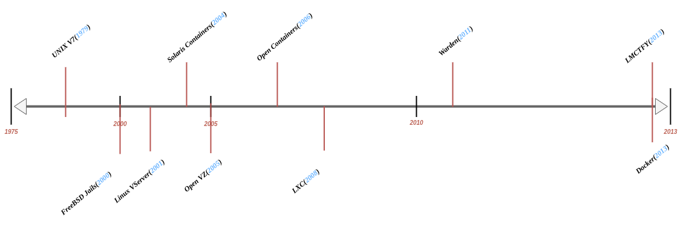

#### Índice
- [Introducción](#introducción)
- [Planteamiento del problema](#planteamiento-del-problema)
- [Objetivo general y específicos](#objetivo-general-y-específicos)
- [Justificación](#justificación)
- [Un poco de historia](#un-poco-de-historia)
  - [Línea de tiempo](#línea-de-tiempo)
  - [1979: Unix V7](#1979-unix-v7)
  - [2000: FreeBSD Jails](#2000-freebsd-jails)
  - [2001: Linux VServer](#2001-linux-vserver)
  - [2004: Solaris Containers](#2004-solaris-containers)
  - [2005: Open VZ (Open Virtuzzo)](#2005-open-vz-open-virtuzzo)
  - [2006: Process Containers](#2006-process-containers)
  - [2008: LXC](#2008-lxc)
  - [2011: Warden](#2011-warden)
  - [2013: LMCTFY](#2013-lmctfy)
  - [2013: Docker](#2013-docker)
- [¿Qué es Docker?](#qué-es-docker)
- [La plataforma de Docker](#la-plataforma-de-docker)
- [¿Para qué puedo usar Docker?](#para-qué-puedo-usar-docker)
    - [Rápido, distribución consistente para tus aplicaciones](#rápido-distribución-consistente-para-tus-aplicaciones)
    - [Despliegue responsivo y escalable](#despliegue-responsivo-y-escalable)
    - [Ejecutando más cargas de trabajo en el mismo hardware](#ejecutando-más-cargas-de-trabajo-en-el-mismo-hardware)
- [La arquitectura de Docker](#la-arquitectura-de-docker)
- [El Docker daemon](#el-docker-daemon)
- [El cliente de Docker](#el-cliente-de-docker)
- [Docker Desktop](#docker-desktop)
- [Registros Docker](#registros-docker)
- [Objetos de Docker](#objetos-de-docker)
  - [Imágenes](#imágenes)
  - [Contenedores](#contenedores)

### Introducción
El objeto de estudio se centra en la investigación de carácter bibliográfico al sistema de gestión de contenedores Docker. Esta será descrita en cuanto a su historia, problemas que originaron su creación, definición, características principales, beneficios y alcances para la demostración práctica en la construcción de un pequeño prototipo.

### Planteamiento del problema
Recuperado del inglés - 10 de Octubre, 2022 [Docker(Inglés)](https://www.docker.com/why-docker/)

Según la web oficial de *Why Docker?*:
> ¿Por qué Docker?
>>  Desarrollar aplicaciones hoy requiere mucho más tiempo que solamente escribir código. Variedad de lenguajes de programación, marcos de trabajo, arquitecturas e interfaces discontinuas entre herramientas por cada ciclo de vida crean una enorme complejidad. Docker lo simplifica y acelera el flujo de trabajo, mientras da a los desarrolladores la libertad de innovar con sus herramientas, conjunto de aplicaciones y despliegues por cada proyecto.

A pesar del avance continuo de la ciencia y tecnología informática, la gestión de aplicaciones siempre ha sido un reto para los agentes TI. El crecimiento de software es constante aumentando costes al momento de distribuirlas e implementarlas al usuario final de forma rápida y concisa. Destacan problemas tales como la **limitación al aumentar hardware, aumento de complejidad al desplegar aplicaciones, difícil actualización o agregación de nueva tecnología, lentitud en la búsqueda de errores y falta de seguridad en los centros de datos al aumentar los componentes tecnológicos.**

### Objetivo general y específicos
- Investigar, documentar, publicar información acerca de Docker como sistemas de gestión de contenedores y desarrollar prototipo aplicado
  - Investigar fuentes oficiales, blogs de tecnología, foros referentes a Docker y otros sistemas de gestión de contenedores
  - Documentar información acerca de Docker y otros sistemas de gestión de contenedores
  - Publicar la información recabada acerca de Docker y otros sistemas de gestión de contenedores
  - Desarrollar un prototipo práctico sencillo para demostrar las características de Docker

### Justificación
La investigación trata sobre obtener información tecnológica de contenedores, sistemas con la capacidad de aislar otros sistemas usando los mismos recursos de un servidor. El motivo es explicar las conveniencias y características de agregar esta tecnología al despliegue de aplicaciones tanto en un entorno local de desarrollo como en producción. Las necesidades del departamento de redes, desarrollo e implementación de software se verán beneficiadas al transformar su trabajo haciéndolo rápido, gestionable, seguro y productivo.

### Un poco de historia
[Recuperado del inglés - 9 de Octubre, 2022 - "Aqua Blog"](https://blog.aquasec.com/a-brief-history-of-containers-from-1970s-chroot-to-docker-2016)

#### Línea de tiempo

#### 1979: Unix V7
Durante el desarrollo del Unix V7 en 1979, un sistema llamado *chroot* fue introducido, cambiando el directorio raíz(root) de un proceso y sus hijos(children) a una nueva ubicación en el sistema de archivos. Este progreso fue el inicio del proceso de aislamiento: separando el acceso de ficheros por cada proceso. *Chroot* fue agregado a [BSD](https://en.wikipedia.org/wiki/Berkeley_Software_Distribution) en 1982.

#### 2000: FreeBSD Jails
Luego de casi dos décadas, cuando un pequeño proveedor de entorno-compartido llegó con las jaulas de FreeBSD para lograr una clara separación entre sus servicios y estos de sus clientes por seguridad y facilitar la administración. Las jaulas de FreeBSD permiten a los administradores particionar un sistema FreeBSD dentro de otro independiente, pequeños sistemas llamados - "jails o jaulas" - con la habilidad de asignar una dirección IP por cada sistema y configuración.

#### 2001: Linux VServer
Como FreeBSD Jails, [Linux VServer](https://en.wikipedia.org/wiki/Linux-VServer) es un mecanismo que puede particionar recursos(sistemas de archivos, direcciones de red, memoria) en un sistema informático. Introducido en 2001, este sistema operativo de virtualización que es implementado agregando un parche al kernel de Linux. Parches experimentales están todavía disponibles, pero el último parche estable fue liberado en 2006.

#### 2004: Solaris Containers
En 2004, la primera beta pública de [Solaris Containers](https://en.wikipedia.org/wiki/Solaris_Containers) fue liberada, esta combina un sistema de recursos de controles y una separación de límites proveídos por zonas, el cual eran capaces de aprovechar características como *snapshots* y clonados desde *ZFS*.

#### 2005: Open VZ (Open Virtuzzo)
Es una tecnología de virtualización de sistemas operativos multinivel para Linux el cual usa un núcleo de Linux modificado para virtualización, aislamiento, gestión y verificación de recursos. El código no fue liberado como una parte del kernel oficial de Linux.

#### 2006: Process Containers
[Contenedores de proceso](https://en.wikipedia.org/wiki/Cgroups)(Lanzado por Google en 2006) fue diseñado para la limitación, contabilidad y aislamiento de los recursos usados(CPU, memoria, I/O discos, redes) de una colección de procesos. Fue renombrado como "Control Groups (cgroups)" un año después y eventualmente fusionado a la versión 2.6.24 del kernel de Linux.

#### 2008: LXC
LXC(LinuX Containers) fue la primera, más completa implementación del administrador de containers de Linux. Este fue implementado en 2008 usando *cgroups* y *Linux namespaces*, y trabaja sobre un single Linux kernel sin ningún parche.

#### 2011: Warden
CloudFoundry inició Warden en 2011, usando *LXC* en los primeros escenarios reemplazandolo con su propia implementación. Warden puede aislar entornos sobre cualquier sistema operativo, ejecutándose como un *daemon* y proveyendo una API para la gestión del contenedor. Desarrollaron un modelo cliente-servidor para gestionar una colección de contenedores a través de multiples hosts, y Warden incluyen un servicio para gestionar *cgroups*, *namespaces* y procesos de ciclo de vida.

#### 2013: LMCTFY
[Let Me Contain That For You](https://github.com/google/lmctfy) salido en 2013 como una version de código abierto de *Google's container stack*, proveyendo contenedores para aplicaciones Linux. Las aplicaciones pueden hacerse de modo "contenedor consciente" creando y gestionando sus propios subcontenedores. El despliegue activo en LMCTFY paró en 2015 luego de que Google empezara a contribuir los conceptos centrales a *libcontainer*, el cual es parte ahora de la [Open Container Foundation](https://github.com/opencontainers/runc/tree/main/libcontainer).

#### 2013: Docker
Cuando Docker emergió en 2013, los contenedores aumentaron su popularidad. No es coincidencia el crecimiento de Docker y el uso del contenedor en un *mano a mano*.
Así como [Warden](#2011-warden) lo hizo, Docker también usó LXC en sus inicios como administrador de contenedores para luego reemplazarlos por su propia biblioteca. Pero no hay duda que Docker por separado ofrece un ecosistema completo de administración de contenedores.

### ¿Qué es Docker?

[Recuperado del inglés - 5 de Octubre, 2022 - Get-started/overview](https://docs.docker.com/get-started/overview/)

Docker es una plataforma abierta para el desarrollo, montaje, y ejecutar aplicaciones. Docker te permite separar tus aplicaciones de la infraestructura para que puedas entregar software rápidamente. Con Docker, puedes gestionar tu infraestructura de la misma forma como gestionas tus aplicaciones. Tomando ventaja de las metodologías para montar, testear y desplegar código rápidamente, puedes disminuir significativamente el retraso de tiempo entre la codificación y ejecución en producción.

### La plataforma de Docker
Docker provee la característica de empaquetar y ejecutar una aplicación en un entorno libremente aislado llamado contenedor. El aislamiento y seguridad te permite ejecutar muchos contenedores simultáneamente en un dado host. Los contenedores son ligeros y contienen todo lo que necesitas para ejecutar la aplicación, de esta manera no necesitas confiar en que está actualmente instalado en el host. Puedes fácilmente compartir contenedores mientras trabajas, y estar seguro que todas las personas comparten contigo el mismo contenedor.

Docker provee herramientas y una plataforma para gestionar el ciclo de vida de tus contenedores:

- Desarrolla tu aplicación y sus componentes usando contenedores.
- El contenedor se convierte en la unidad para distribuir y testear tu aplicación.
- Cuando estés listo, despliega tu aplicación dentro de un entorno de producción, como un contenedor o un servicio orquestado. Funciona de la misma manera si tu entorno de producción es centro local de datos, un proveedor en la nube, o un híbrido de ambos.

### ¿Para qué puedo usar Docker?
##### Rápido, distribución consistente para tus aplicaciones
Docker mejora el ciclo de desarrollo permitiendo a los desarrolladores trabajar en entornos estandarizados usando contenedores locales los cuales proveen tus aplicaciones y servicios. Los contenedores son buenos para la integración continua y entrega continua de flujo de trabajo(CI/CD).

Considera el siguiente escenario de ejemplo:
- Tus desarrolladores escriben código localmente y comparten su trabajo a sus colegas usando los contenedores de Docker.
- Ellos usan docker para subir sus aplicaciones dentro de un entorno de testeo y ejecución automatizada y manual.
- Cuando los desarrolladores encuentran errores(bugs), pueden solucionarlos en el entorno de desarrollo y redistribuirlos hacia el entorno de pruebas para la verificación y validación.
- Cuando la verificación es completa, conseguir un parche para el cliente es tan simple como subir la imagen actualizada para el entorno de producción.

##### Despliegue responsivo y escalable
La plataforma basada en contenedores de Docker permite altas cargas de trabajo portátiles. Los contenedores de docker pueden ejecutarse en una portátil local de desarrollo, en físico o en máquinas virtuales en un centro de datos, en proveedores de servicios en la nube,o en una mezcla de entornos.

La naturaleza portable y ligera de Docker también hace fácil para administrar dinámicamente flujos de trabajo, ampliando o reduciendo aplicaciones y servicios como las necesidades de negocio dictan, en tiempo real.

##### Ejecutando más cargas de trabajo en el mismo hardware
Docker es ligero y rápido. Provee una alternativa viable costo-efectiva de un *hypervisor-based virtual machine*, máquina virtual basada en hipervisor, puedes usar más de tu capacidad de cómputo para lograr tus objetivos de negocio. Docker es perfecto para entornos de alta densidad y para pequeños y medianos despliegues donde tu necesitas hacer más con menos recursos.

### La arquitectura de Docker
Docker está basado en la arquitectura **cliente-servidor**. El cliente de Docker se comunica con el Docker *daemon*, el cual realiza el arranque, construcción, ejecución y distribución de los contenedores. El cliente de Docker y el daemon pueden ejecutarse en el mismo sistema, o puedes conectarte al cliente de Docker desde un daemon remoto. El cliente de Docker y el daemon se comunican usando una API REST, sobre sockets UNIX o una interfaz de red. Otro cliente de Docker es *Docker Compose*, este permite que las aplicaciones trabajen consistiendo en un conjunto de contenedores.

### El Docker daemon
El Docker daemon (`dockerd`) escucha por la API de peticiones y gestiona los objetos tales como imágenes, contenedores, redes y volúmenes. Un daemon también puede se comunica con otros daemons para gestionar los servicios de Docker.

### El cliente de Docker
El cliente de docker (`docker`) es la vía primaria para interactuar con diversos usuarios de Docker. Cuando se utilizan comandos como `docker run`, el cliente envía estos comandos a `dockerd`, que los lleva a cabo. El comando `docker` utiliza la Docker API. El cliente de Docker puede comnicarse con más de un daemon.

### Docker Desktop
Docker Desktop es una forma fácil de instalar la aplicación en Mac, Windows o Linux, eso te permite construir y compartir aplicaciones contenerizadas y microservicios.

### Registros Docker
El registro de Docker almacena imágenes. DockerHub es un registro público que cualquiera puede usar, y Docker está configurado para mirar las imágenes en Docker Hub por defecto. También puedes ejecutar tu registro privado.
Cuando se utiliza el comando `docker pull` o `docker run`, las imágenes requeridas son obtenidas del registro preconfigurado. Cuando se utiliza el comando `docker push`, la imágen es enviada y configurada en el repositorio.

### Objetos de Docker
Cuando se utiliza Docker, se están creando y usando imágenes, contenedores, redes, volúmenes, conectores y otros objetos. Esta sección es un breve vistazo de algunos de estos objetos.

#### Imágenes
Una *imagen* es una plantilla de sólo lectura con algunas instrucciones para crear un contenedor de Docker. Con frecuencia, una imágen está *basada* en otra imagen, con alguna configuración adicional. Por ejemplo, podrías construir una imagen que está basada en `ubuntu`, instalar un servidor web Apache en tu aplicaciones, también los detalles de configuración necesarios para hacer funcionar la aplicación.
Podrías crear tus propias imágenes o usarías estas creadas por otras personas y publicadas en un registro. Para construir tu imagen, debes crear un *Dockerfile* con una sintaxis simple definiendo los pasos necesarios para crear la imagen y ejecutarla. Cada instrucción de un Dockerfile crea una capa en la imagen. Cuando cambias el Dockerfile y regeneras la imagen, solo estas capas las cuales han cambiado son regeneradas. Esta es la parte de porque las imágenes son livianas, pequeñas, y rápidas, comparadas con otras tecnologías de virtualización.

#### Contenedores
Un contenedor es una instancia ejecutable de una imagen. Puedes crear, iniciar, parar, mover o eliminar un contenedor usando la API de Docker o CLI. Puedes conectarte un contenedor a una o más redes, relacionarlo al almacenamiento o incluso crear una nueva imagen basada en el estado actual de la misma.
Por defecto, un contenedor está relativamente bien aislado de otros contenedores y su host. Puedes controlar como la red, el almacenamiento u otros subsistemas de un contendor está aislado de otros contenedores.
Un contenedor es definido por su imagen también como sus opciones de configuración proveídas. Cuando un contenedor es removido, ningún cambio es almacenado y la persistencia desaparece.