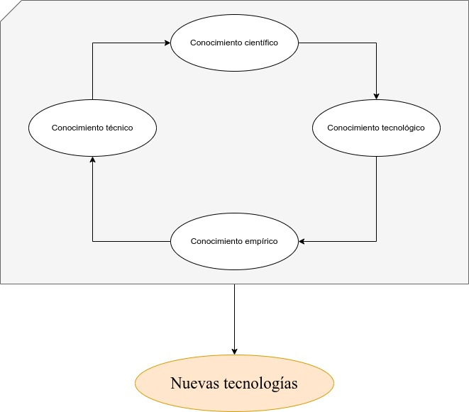

# Unidad III
## Elabora un ensayo académico los procesos de la tecnología

## Introducción
Extracto del Libro "La Investigación Tecnológica" de García Córdoba, capítulo 2 "La Tecnología", página 64:
> La tecnología se considera proceso cuando describe las actividades mediante las cuales el hombre investiga y pone en juego su actitud inquisitiva y su creatividad para conjuntar el conocimiento científico, tecnológico, técnico y empírico, y generar una solución.

### ¿Qué es un proceso?
Mario Bunge menciona en "La ciencia. Su método y su filosofía", Introducción:
> Mientras animales inferiores sólo están en el mundo, el hombre trata de entenderlo; y sobre la base de su inteligencia imperfecta pero perfectible, del mundo, el hombre intenta enseñorearse de él para hacerlo más confortable. En este *proceso*, construye un mundo artificial; ese creciente cuerpo de ideas llamado "ciencia", que puede caracterizarse como conocimiento racional, sistemático, exacto, verificable y por consiguiente falible. Por medio de la investigación científica, el hombre ha alcanzado una reconstrucción conceptual del mundo que es cada vez más amplia, profunda y exacta.

Actualmente disfrutamos de los beneficios entregados por la ciencia/tecnología como lo son: conducir un automóvil, comunicarnos a traves de la Internet con cualquier persona sin importar la distancia, incluso vemos avances significativos en inteligencia artificial para la traducción automática de nuestras conversaciones, automóviles sin conductor humano, preservación de nuestros alimentos en el refrigerador, también en neurociencia ha habido avances significativos en cómo funciona nuestro cerebro, como almacena los recuerdos y como los recupera.

Tiempo atrás hemos dejado los cultivos manuales para gestionarlos automáticamente y de manera segura con maquinaria, fertilizantes artificiales, logrando así alimentar a millones de personas, la explotación del suelo ha sido crítico para la supervivencia y avance de nuestra especie.

Sin olvidar el incidente reciente del cual todavía tenemos secuelas, la pandemia del *COVID-19*, pero los científicos han sido capaces de secuenciar el genoma del virus, investigarlo en el afán de encontrar debilidades y como debilitarlo, doce meses luego, empezaron a probarse las primeras vacunas, desde el tipo *virus atenuado a las ARN mensajeras*, un manejo inteligente de la situación que sin el conocimiento necesario, estaríamos reviviendo la peste negra, paralizando el mundo y su progreso.

Todo lo que hemos logrado como especie ha sido gracias a este proceso riguroso de generación y puesta en campaña del mismo a la realidad, sea obteniendo datos del entorno hasta transformándola para lograr nuestros objetivos, es ciencia aplicada al progreso de la civilización.

Córdoba trata a eso como el conjunto de *conocimiento empírico -> conocimiento técnico -> conocimiento científico -> conocimiento tecnológico*, esto produce nuevas tecnologías. Es decir, mediante la observación, en su forma básica, tratar de obtener algo de la naturaleza sin la rigurosidad(empirismo) para seguir con la memorización de pasos para seguir extrayendo de la realidad sin el método científico, mejorando nuestra forma de ver el mundo, hacer análisis, descubrir nuevas maneras de tratar con la misma haciendo métodos fiables para terminar en la creación de tecnología.

### Lista de pasos sobre cómo hacer tecnología
- Observar
- Determinar
- Documentar
- Reflexionar
- Diseñar
- Valorar
- Comunicar
- Aplicar

Esta es una reducción a fines prácticos, no como un algoritmo a seguir en un orden específico, vamos a explicar brevemente, tenemos pasos conocidos del método científico como *observar, determinar* pero en este escenario ya disponemos el conocimiento probado y seguro para gestionar la realidad, es momento de tomarlos a nuestra conveniencia y a través de la problemática encontrada en el ambiente, encontrar o desarrollar una solución, debemos estar seguros sobre que vamos hacer. *Documentar* y hacerlo bien es un arte, porque a no podemos despreciar la rigurosidad porque se pierden detalles y si lo hacemos muy críptico no llegamos a un gran público, conjugarlos inteligentemente es un desafío de la ciencia de hoy. *Reflexionar* como un proceso cognitivo meramente propio del género y especie *Homo Sapiens*, hay que sopesar variables en nuestro emprendimiento, tales como viabilidad, factibilidad y si cumple con otras espectativas. Con *Diseñar* es poner un pensamiento accionario antes de realizarlo en el mundo de las cosas. *Valorar* pertenece a la reflexión pero esta fase es distinta, porque ya hemos implementado a la realidad, debemos verificar si aquello está logrando el objetivo. Nos queda *comunicar y aplicar* como el deber de enseñar a otros el cómo hacerlo, lo que hemos descubierto en el proceso, transferencia de experiencias y empezar a transformar la realidad.

### Fuentes bibliográficas
> Bunge, M. (2014). La ciencia, su método y su filosofía. SUDAMERICANA.

> Córdoba, G. La Investigación Tecnológica 